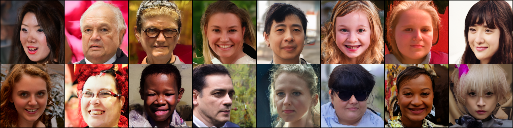

# Facial Diffussion


Input condition (clip-landmark-arcface):


Sample:


Installing:
```
conda env create -f environment.yaml
conda activate diffusers
```

Optional:
```
pip install -U xformers
```

Training:
```
accelerate launch --config_file configs/accelerate.yaml train_conditioned.py --config ./configs/ffhq-vqvae-clip.yaml